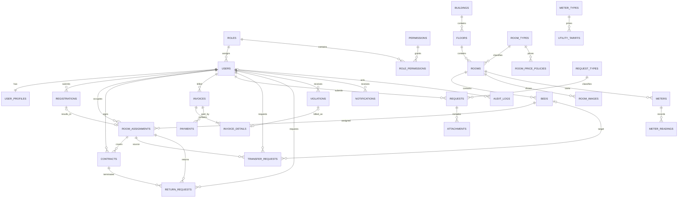

# ERD and Data Integrity Rules

Trạng thái: **ACCEPTED**

Đây là logical ERD cho modular monolith. Tên cột cuối cùng sẽ được khóa trước khi tạo Flyway migration Phase 1.

## 1. Logical ERD



## 2. Module ownership

| Module | Tables |
|---|---|
| Identity | `users`, `user_profiles`, `roles`, `permissions`, `role_permissions`, `token_sessions` |
| Facility | `buildings`, `floors`, `room_types`, `room_price_policies`, `rooms`, `room_images`, `beds` |
| Registration | `registrations` |
| Occupancy | `room_assignments`, `transfer_requests`, `return_requests` |
| Contract | `contracts`, contract version/addendum table nếu được duyệt |
| Billing | `meters`, `meter_readings`, `utility_tariffs`, `invoices`, `invoice_details`, `payments`, deposit transactions |
| Operations | `request_types`, `requests`, `attachments`, `violations` |
| Notification | `notifications`, optional delivery attempts |
| Audit | `audit_logs` |

Module khác không truy cập trực tiếp repository nội bộ nếu có thể đi qua application service.

## 3. Primary key và audit fields

- Primary key: UUID.
- Entity nghiệp vụ mutable có `created_at`, `updated_at`, `created_by`, `updated_by`.
- Soft-delete chỉ thêm khi entity thực sự cần khôi phục/ẩn; không mặc định cho mọi bảng.
- Transaction record như Payment, Meter Reading, Audit Log không hard delete.
- Entity có concurrent update quan trọng thêm `version BIGINT` cho optimistic locking khi phù hợp.

## 4. Required database constraints

### Identity

- Unique normalized username.
- Unique normalized email.
- Unique non-null student code.
- Unique non-null identity number nếu được duyệt.
- Role code và permission code unique.

### Facility

- Building code unique.
- `(building_id, floor_number)` unique.
- `(floor_id, room_code)` unique.
- `(room_id, bed_code)` unique.
- Room capacity > 0.
- Room capacity chỉ nhận 4, 6 hoặc 8 trong Room Type MVP.
- Room price và deposit không âm.
- Room Image lưu metadata, relative storage key/path, content type, size, sort order và cover flag.
- Mỗi Room tối đa một cover image.

### Registration và occupancy

PostgreSQL partial unique index đề xuất:

```sql
CREATE UNIQUE INDEX uq_active_assignment_user
    ON room_assignments(user_id)
    WHERE status = 'ACTIVE';

CREATE UNIQUE INDEX uq_active_assignment_bed
    ON room_assignments(bed_id)
    WHERE status = 'ACTIVE';

CREATE UNIQUE INDEX uq_active_contract_user
    ON contracts(user_id)
    WHERE status = 'ACTIVE';
```

- `start_date <= end_date` khi end date có giá trị.
- Registration PENDING/APPROVED active uniqueness được chốt bằng partial index theo rule cuối cùng.
- Transfer/Return Request active uniqueness theo USER.

### Meter

- `(room_id, meter_type)` chỉ có một Meter ACTIVE tại một thời điểm.
- `reading_value >= 0`, `consumption >= 0`.
- `(meter_id, reading_date)` unique hoặc unique theo billing period sau khi chốt granularity.
- Reset Meter phải có reset event/flag và reason.

### Invoice và payment

- Invoice code unique.
- Payment code unique.
- `quantity >= 0`, `unit_price >= 0`, `amount >= 0`.
- `subtotal`, `discount`, `fine_amount`, `total_amount`, `paid_amount` không âm.
- `paid_amount <= total_amount` khi cấm overpayment.
- Idempotency key unique theo payment provider/method.
- Không dùng database trigger để chứa toàn bộ business logic; invariant nhiều bảng được giữ bằng transaction + lock + test.

## 5. Concurrency strategy

### Assign Bed

1. Begin transaction.
2. Lock USER và BED/active assignment candidates bằng `SELECT ... FOR UPDATE` hoặc repository pessimistic lock.
3. Kiểm tra Room/Bed status.
4. Kiểm tra partial unique invariant.
5. Tạo Assignment ACTIVE.
6. Cập nhật Bed OCCUPIED.
7. Commit.

Unique index là lớp bảo vệ cuối cùng nếu hai transaction cạnh tranh.

### Payment

1. Kiểm tra idempotency key.
2. Lock Invoice.
3. Tính remaining amount từ Payment SUCCESS trong database.
4. Tạo/cập nhật Payment.
5. Cập nhật `paid_amount` và Invoice status.
6. Commit.

### Transfer/Return

- Lock old Assignment, old Bed, target Bed (nếu có), active Contract và related Request.
- Lock theo thứ tự ID ổn định để giảm deadlock.
- Mọi thay đổi Bed–Assignment–Contract–Request nằm trong cùng transaction.

## 6. Redis boundary

Redis được phép dùng cho:

- Token blacklist.
- Login/reset-password rate limit.
- Cache room catalogue/availability projection.
- Cache dashboard/report ngắn hạn.
- Notification pub/sub nếu cần.
- Payment idempotency fast-path, nhưng unique constraint PostgreSQL vẫn bắt buộc.

Redis không quyết định:

- Bed có được assign hay không.
- Invoice đã paid hay chưa.
- Contract/Assignment có active hay không.
- USER có quyền sở hữu resource hay không.

## 7. Migration policy

- Không sửa `V1__init_schema.sql` và `V2__data.sql` đã tồn tại.
- Migration KTX bắt đầu từ `V3__...sql`.
- Mỗi migration nhỏ, có tên mô tả rõ và chạy một chiều.
- Test migration trên database sạch và database có V1/V2.
- Seed role/permission tách khỏi demo data.

